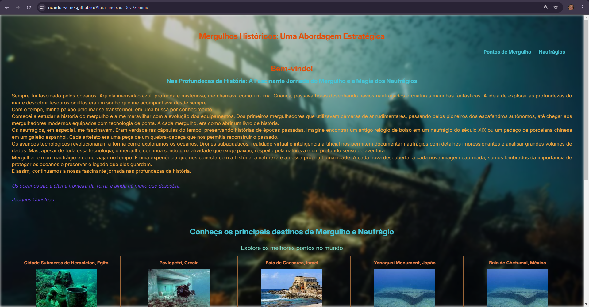
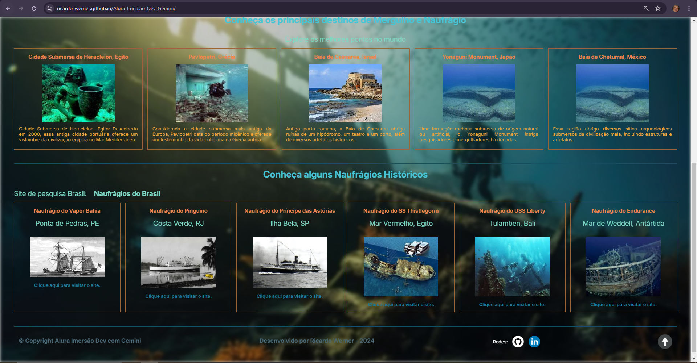

# Título do Projeto

  ##Mergulhos Históricos: Uma Abordagem Estratégica


### 📜 Sobre o Projeto

Foi proposto neste projeto foi criar uma página de conteúdo livre, utilizando o Google Gemini, como auxiliar na estruturação, explicações de código e construção de ideias.

### 🔗 Links Úteis

- [](https://www.github.com/ricardo-werner)
- [](https://linkedin.com/in/ricardo-werner)

### ✅ Status do Projeto

**Em Desenvolvimento**


#### Tela do Cabeçalho

<p align="center">
  
</p>

#### Tela do Conteúdo

<p align="center">
  
</p>

#### Pagina de acesso pelo deploy no Github

<p>
  https://ricardo-werner.github.io/Alura_Imersao_Dev_Gemini/
</p>

### 🧩 Desafio

####Otimizando a gestão de conteúdos textuais através de JavaScript

A minha ideia inicial, era de desenvolver uma página que vizava a facilidade de manutenção futura e otimizar a gestão de conteúdos textuais, tornando-o mais dinâmico e fácil de manter. Para isso, com a ajuda do Google Gemini, desenvolvemos uma solução personalizada utilizando JavaScript e a biblioteca Fetch API. A principal funcionalidade consiste em carregar dados de um arquivo JSON e renderizá-los diretamente nas páginas HTML, eliminando a necessidade de editar o código manualmente a cada atualização.

####Desafios e Soluções

Um dos principais desafios foi garantir a correta formatação dos textos, especialmente em relação às quebras de linha. Para solucionar este problema, implementamos um mecanismo de substituição de caracteres de nova linha (\n) por tags HTML <br>, garantindo assim uma apresentação visual mais agradável e consistente.

####Resultados e Próximos Passos

A implementação desta solução trouxe diversos benefícios, como a centralização dos conteúdos em um único arquivo, a agilidade na atualização da página e a redução de erros humanos. Como próximos passos, planejo expandir a funcionalidade de cadastrar novos pontos de mergulho e naufrágios, centralizar todos os cadastros em uma tabela com campo de pesquisa e explorar a possibilidade de utilizar outras boas práticas para a manutenção do código.

### 📝 Requisitos da Aplicação

| Item | Descrição                                                                 |
| ---- | ------------------------------------------------------------------------- |
| 1    | A aplicação deve ser desenvolvida em HTML, CSS e JavaScript.              |
| 2    | A aplicação deve utilizar apoio da IA Gemini (Google)                     |
| 3    | Modelagem do layout, formatos, tipografias, cores e organização livregma. |

|

### 🚀 Plano do Projeto

No desenvolvimento desta aplicação, foram aplicados os seguintes conceitos:

| Item | Descrição                                           |
| ---- | --------------------------------------------------- |
| 1    | HTML                                                |
| 2    | CSS                                                 |
| 3    | JavaScript                                          |
| 4    | IA Gemini (Google)                                  |
| 5    | Aplicação de estruturação para manutenção do código |

### 🛠 Tecnologias Utilizadas

- **Visual Studio Code**
- **HTML**
- **CSS**
- **JavaScript**
- **Google Gemini**

### 💡 Reflexões

Desenvolver este projeto foi uma experiência extremamente enriquecedora, proporcionando um aprofundamento significativo nas práticas de desenvolvimento web. Foi possível explorar a flexibilidade do HTML, CSS e JavaScript, além de refletir sobre a importância de uma estruturação inteligente para facilitar a manutenção futura das aplicações.

### 📦 Como Executar o Projeto

1. Clone o repositório:

   ```bash
    https://github.com/ricardo-werner/Alura_Imersao_Dev_Gemini.git

   ```

2. Abra o projeto no Visual Studio Code e ative o Go Live:

   ```bash
   <p align="center">
    
   </p>

   <p align="center">
    
   </p>

   ```

3. Visualize o resultado na página web:

   ```bash
   <p align="center">
    
   </p>
   ```

### 🙋‍♂️ Autor

Ricardo Werner
Dev em Desenvolvimento
